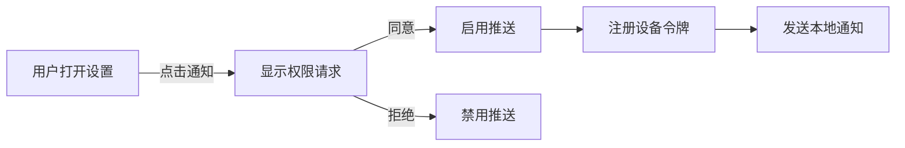

# 🚀 IAP 和推送通知完整实现指南

## 📋 目录
1. [IAP 支付流程实现](#iap-支付流程实现)
2. [本地推送通知实现](#本地推送通知实现)
3. [后端 FCM 集成](#后端-fcm-集成)
4. [验证和测试](#验证和测试)

---

## 🛍️ IAP 支付流程实现

### iOS 端（已完成）

**文件**: `Services/PurchaseManager.swift`

#### 新增功能:
```swift
// 恢复购买
func restorePurchases() async -> Bool

// 检查订阅有效性
func isSubscriptionValid() async -> Bool

// 获取订阅状态
func getSubscriptionStatus() -> SubscriptionStatus
```

#### 工作流程:
1. **初始化** → `setupPurchases()` 从 App Store 获取产品信息
2. **购买** → `purchase(product)` 处理支付
3. **验证** → 自动验证 App Store 收据
4. **通知后端** → `notifyServerPurchase()` 告知后端
5. **更新状态** → `updatePurchasedProducts()` 更新购买记录

---

## 🔔 本地推送通知实现

### iOS 端（已完成）

**新文件**: `Services/NotificationManager.swift`

#### 主要功能:

```swift
// 请求权限
requestNotificationPermission() -> Bool

// 发送新闻通知
sendNewsNotification(title, summary, category, articleID)

// 发送 Pro 功能提示
sendProFeatureNotification()

// 定期类别通知（每天8点）
schedulePeriodicCategoryNotification(category, articleCount)

// 处理通知点击
userNotificationCenter(..., didReceive response)
```

#### UI 集成 (`Views/SettingsView.swift`):

```
设置 > 通知
├─ 启用推送通知 (Toggle)
├─ 状态指示器 (绿色 = 已启用)
└─ 通知类别设置 (NavigationLink)
```

#### 权限流程:



---

## 📱 后端 FCM 集成

### Python 后端（已完成）

**新文件**: `API/notifications.py`

#### 模块结构:

```
notifications.py
├─ FirebaseNotificationManager
│  ├─ send_notification()        # 单设备
│  ├─ send_multicast()          # 多设备
│  └─ subscribe_to_topic()      # 主题订阅
│
├─ SubscriptionManager
│  ├─ verify_receipt()          # 验证收据
│  ├─ notify_purchase()         # 记录购买
│  └─ get_subscription_status() # 查询状态
│
└─ 辅助函数
   ├─ create_news_notification()
   └─ create_subscription_notification()
```

#### 新增后端端点:

| 路径 | 方法 | 功能 |
|------|------|------|
| `/v1/subscription/verify-receipt` | POST | 验证收据 |
| `/v1/subscription/purchase` | POST | 处理购买 |
| `/v1/subscription/status` | GET | 查询订阅状态 |
| `/v1/notifications/register-device` | POST | 注册设备令牌 |
| `/v1/notifications/send-test` | POST | 发送测试通知 |

---

## 🔧 配置步骤

### 1️⃣ Firebase 配置

#### 1.1 创建 Firebase 项目
```bash
# 访问 Firebase 控制台
https://console.firebase.google.com

# 创建新项目
# 项目名: "SeeNews"
# 启用 FCM
```

#### 1.2 下载服务账户密钥
```bash
# Firebase Console > 项目设置 > 服务账户 > 生成私密秘钥 (JSON)
# 将文件保存为: firebase-credentials.json
# 复制到: API/firebase-credentials.json
```

#### 1.3 环境变量配置
```bash
# 创建或编辑 .env 文件
FIREBASE_CREDENTIALS_PATH="./firebase-credentials.json"
GOOGLE_APPLICATION_CREDENTIALS="./firebase-credentials.json"
```

#### 1.4 安装依赖
```bash
cd API
pip install -r requirements.txt
# 包含: firebase-admin>=6.4.0
```

### 2️⃣ iOS 端配置

#### 2.1 推送通知能力
```
✅ Xcode Project > Signing & Capabilities
   └─ "+ Capability"
      ├─ [✓] Push Notifications
      ├─ [✓] Background Modes
      │  └─ [✓] Remote notifications
      └─ [✓] App Groups (可选)
```

#### 2.2 App Store 配置
```
App Store Connect > 您的应用
├─ 应用功能
│  └─ 推送通知: 启用
│
├─ 签名证书
│  ├─ Apple Push Notification service (APNs) 证书
│  └─ 上传 .p8 密钥
│
└─ In-App Purchase
   ├─ 创建订阅配置
   ├─ com.3secnews.pro.monthly
   │  └─ 价格: ¥680 / 月
   ├─ com.3secnews.pro.yearly
   │  └─ 价格: ¥6,800 / 年 (17% 折扣)
   └─ 状态: 可供出售
```

#### 2.3 代码配置 (`FurinNewsApp.swift`)
```swift
// AppDelegate 自动处理远程通知
// 设备令牌自动保存到 UserDefaults: "deviceToken"
// 应用启动时自动注册
```

### 3️⃣ 后端部署

#### 3.1 部署新代码
```bash
cd ~/WorkBuddy/20260412212940/SeeNewsCore
gcloud run deploy newsnow-backend \
  --source . \
  --region asia-northeast1 \
  --set-env-vars "FIREBASE_CREDENTIALS_PATH=./firebase-credentials.json"
```

#### 3.2 验证新端点
```bash
# 测试通知端点
curl -X POST https://newsnow-backend-[PROJECT_ID].asia-northeast1.run.app/v1/notifications/send-test \
  -H "Content-Type: application/json" \
  -d '{
    "device_token": "your-device-token",
    "title": "テスト",
    "body": "通知テスト"
  }'

# 预期响应:
{
  "success": true,
  "message": "Test notification sent"
}
```

---

## ✅ 验证和测试

### 测试清单

- [ ] **本地通知**
  ```
  1. 打开设置 > 通知
  2. 启用"プッシュ通知"
  3. 查看权限对话框
  4. 同意权限
  5. 状态指示器应变绿色
  ```

- [ ] **IAP 购买**
  ```
  1. iOS 14+ 沙箱测试账户
  2. 点击 SubscriptionView > Pro 计划
  3. 选择月度/年度
  4. 点击"購入する"
  5. 完成支付流程
  6. 记录日志验证必要步骤
  ```

- [ ] **后端开发**
  ```
  1. curl 调用 /v1/subscription/status
  2. curl 调用 /v1/notifications/send-test
  3. 查看 server.py 日志输出
  ```

### 🧪 测试推送通知

#### 使用 Firebase Console:
```
1. Firebase Console > Cloud Messaging
2. 创建 Campaigns
3. 选择受众: 按设备选择
4. 输入设备令牌 (从 UserDefaults 获取)
5. 点击 Send
```

#### 使用后端测试端点:
```python
# 从应用获取设备令牌 (检查日志或 UserDefaults)
device_token = "ExponentPushToken[...]"

# 调用测试端点
curl -X POST \
  "https://newsnow-backend-[ID].asia-northeast1.run.app/v1/notifications/send-test" \
  -H "Content-Type: application/json" \
  -d "{\"device_token\": \"$device_token\", \"title\": \"テスト\"}"
```

---

## 📊 常见问题 (FAQ)

### Q: "No products returned from App Store"
**A:** 
1. 验证 Bundle ID: `com.3secnews.app`
2. 确认 IAP 产品在 App Store Connect 中存在
3. 使用 TestFlight 或沙箱测试账户

### Q: 通知不显示
**A:**
1. 检查权限: 设置 > 通知 > 应用名称
2. 验证 device_token 已保存 (检查 UserDefaults)
3. 检查后端日志: `gcloud run logs read newsnow-backend`
4. Firebase 未配置时使用 mock 模式

### Q: 推送通知权限弹窗不出现
**A:**
1. 确认 Push Notifications 能力已启用
2. 检查 Xcode: 目标 > Signing & Capabilities
3. 清除应用数据重新安装

### Q: Firebase 初始化失败
**A:**
1. 验证 credentials JSON 文件存在
2. 检查文件权限
3. Review 环境变量: `GOOGLE_APPLICATION_CREDENTIALS`

---

## 🎯 下一步优化

### 短期 (1-2 周)
- [ ] 在 Sandbox 中完整测试 IAP 流程
- [ ] 配置 FCM 和部署后端
- [ ] 发送第一条推送通知

### 中期 (2-4 周)
- [ ] 实现订阅有效期检查
- [ ] 添加收据验证日志
- [ ] 性能监控

### 长期 (1-2 月)
- [ ] A/B 测试通知策略
- [ ] 用户分析集成
- [ ] 订阅自动续期处理

---

## 📚 参考资源

- [StoreKit2 Documentation](https://developer.apple.com/documentation/storekit)
- [Firebase Admin SDK](https://firebase.google.com/docs/admin/setup)
- [APNs Documentation](https://developer.apple.com/documentation/usernotifications)
- [App Store Connect Help](https://help.apple.com/app-store-connect)

